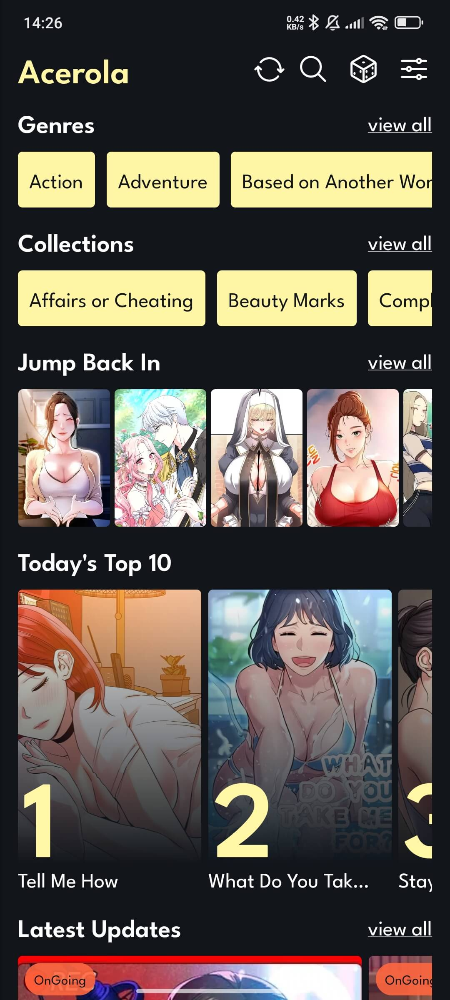
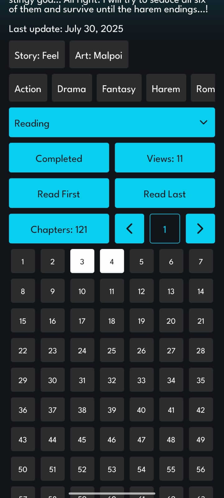
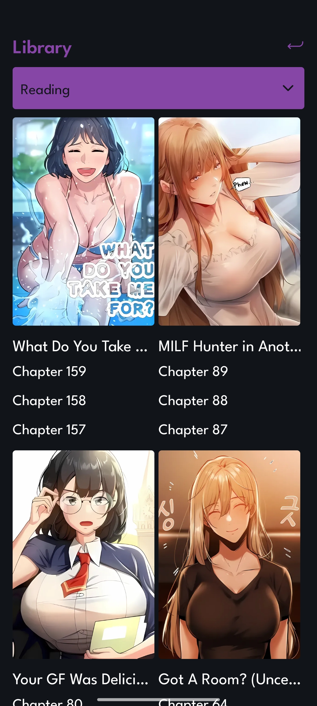
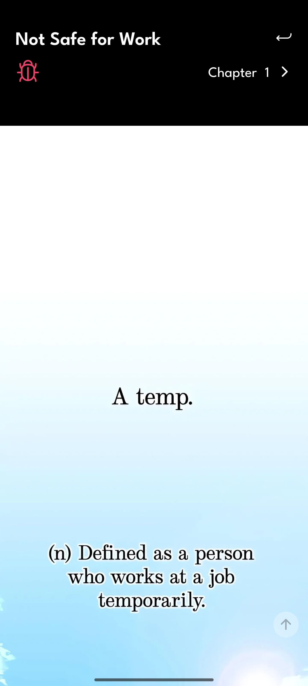

# Acerola - Manhwa Reader (NSFW)

Acerola is a React Native mobile app for reading adult manhwas (pornhwa), developed with a focus on Android. Testing has not been performed on iOS. If you're interested in working on the iOS version, please contact me, and I can provide access to a test database for development. You can audit the source code and download the latest APK from the Releases section.

# Backend & Infrastructure

- Images are hosted via Cloudflare.

- The database is currently on a free Supabase instance. The need for a more robust instance will be assessed as the project grows.

# Support the Project
 
Acerola is free to use. If you'd like to support server costs, donations are welcome. Donation details for PayPal and Bitcoin are available in the app's menu.

# Features

- Offline Access: The database, with over 500 manhwas, is stored locally on your device for fast performance.

- Sync: Keep your local library up-to-date by tapping the sync button on the home page to fetch the latest data from the cloud.

# Permissions (Android)

The app's Bug Report feature allows users to attach images. The application will only access the specific images you choose to send.

    <uses-permission android:name="android.permission.INTERNET"/>
    <uses-permission android:name="android.permission.READ_EXTERNAL_STORAGE"/>
    <uses-permission android:name="android.permission.WRITE_EXTERNAL_STORAGE"/>
    <uses-permission android:name="android.permission.SYSTEM_ALERT_WINDOW"/>
    <uses-permission android:name="android.permission.VIBRATE"/>

# APK

The APK is available in the project's 'Releases' tab here on GitHub. Feel free to verify the APK with online analysis tools such as https://www.androidfreeware.net/apk-check or https://sisik.eu/apk-tool. Alternatively, you can use an Android Emulator to safely test the app.

# Usability

The app's interface is entirely in English and is designed to be intuitive. If you're familiar with mobile apps, you'll find it easy to use. Screenshots are provided below to give you a preview.

# Home

# Manhwa Page

# Library

# Chapter Reader

# Random Manhwas

