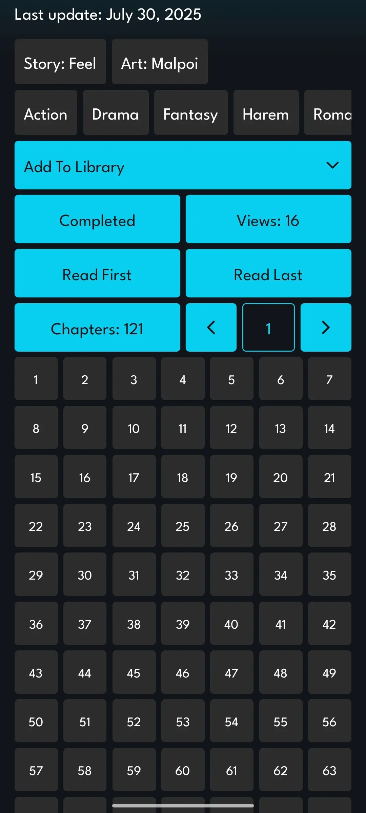

# Acerola - Manhwa Reader (NSFW)

Acerola is a React Native mobile app for reading adult manhwas (pornhwa), developed with a focus on Android. It has not been tested on iOS. If you're interested in working on the iOS version, please contact me, and I can provide access to a test database for development. You can audit the source code and download the latest APK from the Releases section.

# Backend & Infrastructure

- Images: Hosted and delivered via Cloudflare infrastructure.

- Database: Uses a free Supabase instance (may be upgraded as the project grows).

- Local First: A database of 550+ manhwas is stored locally for fast performance.

- Sync: Tap the sync button on the home page to fetch the latest data from the cloud

# Permissions (Android)

The app's Bug Report feature allows users to attach images. The application will only access the specific images you choose to send.

    <uses-permission android:name="android.permission.INTERNET"/>
    <uses-permission android:name="android.permission.READ_EXTERNAL_STORAGE"/>
    <uses-permission android:name="android.permission.WRITE_EXTERNAL_STORAGE"/>
    <uses-permission android:name="android.permission.SYSTEM_ALERT_WINDOW"/>
    <uses-permission android:name="android.permission.VIBRATE"/>

# APK

The APK is available in the project's Releases tab here on GitHub. Feel free to verify the APK with online analysis tools such as https://www.androidfreeware.net/apk-check or https://sisik.eu/apk-tool. Alternatively, you can use an Android Emulator to safely test the app.

# Support the Project
 
Acerola is free to use.

If you’d like to help cover server costs, donations are welcome. Details are available in the app’s menu.

# Safe Mode

Safe Mode can be enabled in the settings. With Safe Mode enabled, the app behaves like a simple to-do list. To access the main content (pornhwa), you must enter the password you previously set.

If you forget the password, it cannot be reset or recovered. To regain access to the main content, you must delete the app data via Android or iOS settings and restart the app.

  
  

# Usability

The interface is entirely in English and designed to be intuitive.
If you’ve used mobile apps before, you’ll find it easy to navigate.
Screenshots are included below for reference.

  
  

