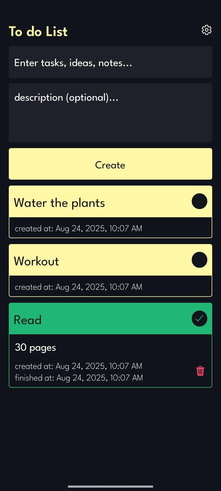
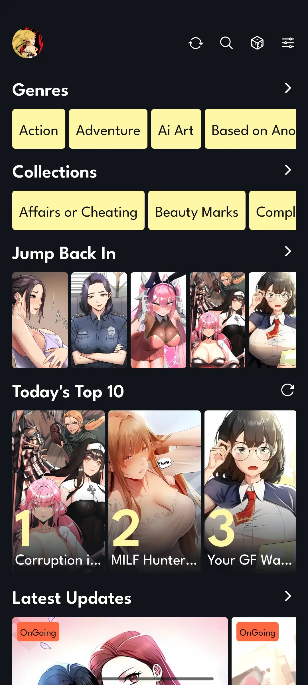
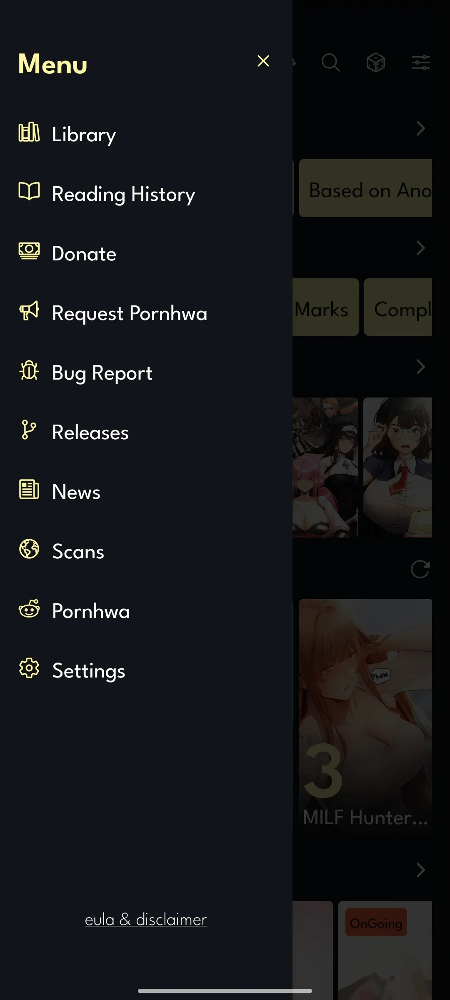
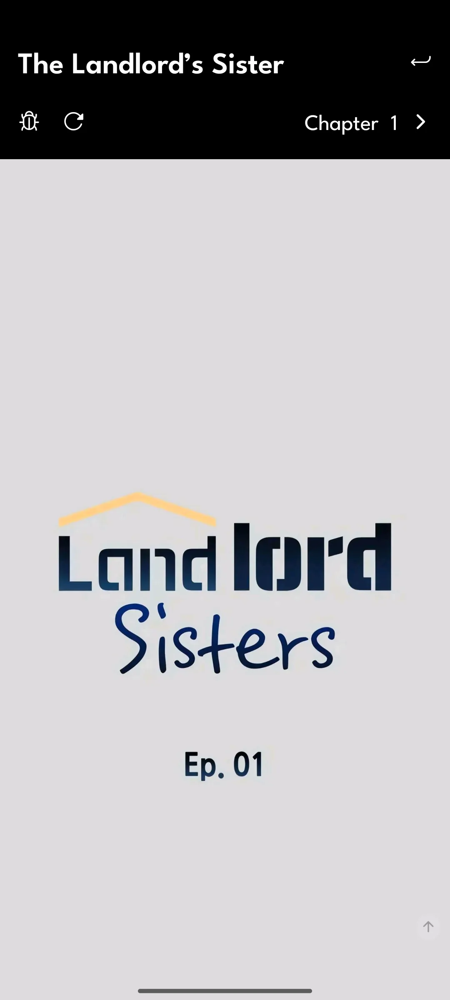

# Acerola - Adult Manhwa Reader (NSFW)

Acerola is a React Native mobile app for reading adult Manhwa (Pornhwa). Currently, only an Android version is available via APK.

# Backend & Infrastructure

- Images: Hosted and delivered by Cloudflare.

- Database: Uses a free Supabase instance (may be upgraded as the project grows).

- Local First: A local database with over 610 manhwas is stored on the device to ensure fast performance.

- Sync: Tap the sync button on the home page to fetch the latest data from the cloud.

# Permissions

The Bug Report feature allows users to attach images. Only the images you choose to send will be accessed.

    <uses-permission android:name="android.permission.INTERNET"/>
    <uses-permission android:name="android.permission.READ_EXTERNAL_STORAGE"/>
    <uses-permission android:name="android.permission.WRITE_EXTERNAL_STORAGE"/>
    <uses-permission android:name="android.permission.SYSTEM_ALERT_WINDOW"/>
    <uses-permission android:name="android.permission.VIBRATE"/>

# APK

You can verify the APK with online analysis tools such as https://www.androidfreeware.net/apk-check or https://sisik.eu/apk-tool. Alternatively, use an Android emulator to safely test the app.

| Architecture   | Description                                                                 | Who Should Install                                      |
|---------------|-----------------------------------------------------------------------------|-------------------------------------------------------|
| [arm64-v8a](https://github.com/acerolatz/Acerola/releases/download/v1.1.0/com.ougi.acerola-v1.1.0-arm64-v8a.apk) | 64-bit architecture for modern ARM-based devices. Offers better performance and efficiency. | Most modern Android devices (2017 and newer)          |
| [armeabi-v7a](https://github.com/acerolatz/Acerola/releases/download/v1.1.0/com.ougi.acerola-v1.1.0-armeabi-v7a.apk) | 32-bit architecture for older ARM-based devices. Compatible with many legacy models. | Older smartphones and tablets (pre-2017)              |
| [x86](https://github.com/acerolatz/Acerola/releases/download/v1.1.0/com.ougi.acerola-v1.1.0-x86.apk)       | 32-bit architecture for Intel-based Android devices. Rare in recent years.  | Android emulators or older Intel-powered Android devices                   |
| [x86_64](https://github.com/acerolatz/Acerola/releases/download/v1.1.0/com.ougi.acerola-v1.1.0-x86_64.apk)   | 64-bit architecture for Intel-based Android devices. Less common nowadays.  | Android emulators or newer Intel-powered Android devices                   |
| [universal](https://github.com/acerolatz/Acerola/releases/download/v1.1.0/com.ougi.acerola-v1.1.0-universal.apk) | Contains binaries for **all** supported architectures, so it runs everywhere but has a larger file size. | Recommended if you're unsure about your device's CPU  |

# Safe Mode

When Safe Mode is enabled, the app behaves like a simple to-do list, and you can only access the pornhwas with a password you set yourself. Safe Mode can be enabled in the settings.

If you forget the password, it cannot be reset or recovered. You must clear the app's data via your Android settings to regain access to the main content.

  
  

# Support the Project
 
Acerola is free to use.

If you’d like to help cover server costs, donations are welcome. Details are available in the app’s menu.

# Usability

The interface is in English and designed for intuitive navigation. Screenshots are included below for a preview.

  
  

---

  
  

---

  
  

---

  
  

---

  
  

